# CLAUDE.md

This file provides guidance to Claude Code (claude.ai/code) when working with code in this repository.

## Project Overview

This is a POC (Proof of Concept) for demonstrating Sentry monitoring capabilities in an iGaming platform context. The project aims to showcase how Sentry can improve reliability, performance, and user experience in a critical gaming system.

You must always follow memory approach! Each type PHASE:TRANSITION command load phase definition and rules related to transition phase!  

## Memory Bank System Overview

Memory Bank is a token-optimized, hierarchical task management system originally designed for universal development phases. This codebase demonstrates how to translate platform-specific agent instructions into universal, platform-agnostic development workflows that can be used with any AI agent.

### Core Concept: Universal Agent Translation

The key innovation is translating universal development phases (which are limited to specific editor features) into a universal "memory bank" approach that works with any AI assistant by:

1. **Modes → Development Phases**: Each phase (VAN, PLAN, CREATIVE, etc.) represents a specific development phase with its own cognitive model
2. **Custom Instructions → Persistent Context**: Mode-specific instructions become persistent context files stored in the memory-bank/ directory
3. **Tool Selection → Phase-Appropriate Actions**: Each phase enables only relevant capabilities
4. **Visual Process Maps → Decision Trees**: Mermaid diagrams provide workflow guidance independent of the AI platform

### Memory Bank Storage

All persistent context is stored in the `memory-bank/` directory at the project root:

```
memory-bank/
├── tasks.md              # Central task tracking
├── activeContext.md      # Current development focus
├── progress.md           # Implementation status
├── creative-*.md         # Design decision documents
└── reflect-*.md          # Review and lessons learned
```

## Common Development Commands

### Working with Memory Bank Files

```bash
# View current tasks
cat memory-bank/tasks.md

# Update active context
echo "New context information" >> memory-bank/activeContext.md

# Check implementation progress
cat memory-bank/progress.md
```

### Rule System Navigation

```bash
# View main rule entry point
cat universal_rules/main-optimized.md

# List all rule files
find universal-system/universal_rules -name "*.md" -type f

# View visual process maps
ls universal_rules/visual-maps/
```

### Mode Instructions

```bash
# View all mode instructions
ls custom_modes/

# Read specific mode instructions
cat custom_modes/van_instructions.md
```

## High-Level Architecture

### 1. Development Workflow Phases

The system uses 6 specialized phases that form a complete development workflow:

```mermaid
graph LR
    VAN[🔍 VAN<br>Initialize] --> PLAN[📋 PLAN<br>Task Planning]
    PLAN --> CREATIVE[🎨 CREATIVE<br>Design]
    CREATIVE --> IMPLEMENT[⚒️ IMPLEMENT<br>Build]
    IMPLEMENT --> REFLECT[🔍 REFLECT<br>Review]
    REFLECT --> ARCHIVE[📚 ARCHIVE<br>Document]
```



### 2. Hierarchical Rule Loading

Rules are organized hierarchically to optimize token usage:

```
universal_rules/
├── main-optimized.md        # Entry point with JIT loading
├── Core/                     # Shared across all modes
│   ├── core-mode-behavior.md
│   └── platform-awareness.md
├── Level1-4/                 # Complexity-specific workflows
├── Phases/                   # Mode-specific rules
└── visual-maps/              # Process guidance diagrams
```

### 3. Complexity Levels

Tasks are categorized into 4 levels with adapted workflows:

- **Level 1**: Quick fixes (3 phases: VAN → IMPLEMENT → REFLECT)
- **Level 2**: Enhancements (4 phases: add PLAN)
- **Level 3**: Features (5 phases: add CREATIVE)
- **Level 4**: Enterprise (6 phases: add ARCHIVE)

### 4. Universal Translation Principles

When translating platform-specific instructions to universal agent instructions:

1. **Replace mode switching** with context file updates in memory-bank/
2. **Convert tool selections** to phase-appropriate action recommendations
3. **Transform custom instructions** into persistent markdown documents
4. **Maintain visual process maps** as universal workflow guides
5. **Use hierarchical loading** by referencing only needed documentation

## Key Implementation Patterns

### 1. Phase Transitions

Instead of switching phases, update the activeContext.md file:

```markdown
# activeContext.md
Current Phase: IMPLEMENT
Previous Phase: PLAN
Task Focus: User authentication feature
Complexity Level: 3
```

### 2. Task Tracking

Maintain tasks.md as the central source of truth:

```markdown
# tasks.md
## Active Tasks
- [ ] Implement user authentication (Level 3)
  - [x] Design authentication flow
  - [ ] Build login component
  - [ ] Add session management

## Completed Tasks
- [x] Setup project structure
```

### 3. Design Documentation

Create creative-*.md files for design decisions:

```markdown
# creative-auth-2024-01-15.md
## Authentication Design Options

| Option | Pros | Cons | Decision |
|--------|------|------|----------|
| JWT | Stateless, scalable | Token management | ✓ Selected |
| Sessions | Simple, secure | Server state | Not selected |
```

### 4. Progress Tracking

Update progress.md with implementation status:

```markdown
# progress.md
## Current Sprint
- Login component: 80% complete
- Session management: Not started
- Error handling: In progress
```

## Universal Agent Usage

To use this system with any AI agent:

1. **Initialize**: Create memory-bank/ directory and initial files
2. **Check Phase Status**: Read phase-context.md for current phase
3. **Use Phase Commands**: 
   - `PHASE:STATUS` - Check current phase
   - `PHASE:TRANSITION <target>` - Change phases
   - `PHASE:VALIDATE` - Verify consistency
   - `PHASE:CAPABILITIES` - List available actions
4. **Load Phase Rules**: Reference universal format rules based on phase
5. **Update Context**: Maintain all memory bank files
6. **Track Progress**: Use tasks.md and progress.md for state management
7. **Document Decisions**: Create timestamped creative-*.md and reflect-*.md files

## POC Goals & Focus

**PRIMARY GOAL**: Create minimal, working code that effectively demonstrates Sentry's value for iGaming platforms.

### Key Demonstration Points:
- **MTTR Reduction**: Show how Sentry reduces issue resolution time from 4-6 hours to 30-60 minutes
- **Error Rate Improvement**: Demonstrate tracking and reducing errors from 2.5% to <0.5%
- **Performance Gains**: Show P95 latency improvements from 800ms to 200ms
- **Alert Noise Reduction**: From 200 to 10 meaningful alerts per day

### Development Approach:
- **Minimal Viable Code** - Just enough to demonstrate each Sentry feature
- **Real Scenarios** - Include actual bugs, performance issues, and errors
- **Quick Setup** - Services should be easy to run locally
- **Clear Demos** - Each issue should be easily reproducible

## Technology Stack

### Language Versions & Frameworks:
- **Go**: 1.18+
- **Python**: 3.8+ with Tornado 6.x
- **Node.js**: 14.x+ (ES2015+)
- **Angular**: 13+
- **React**: 17

## Architecture

The system consists of 8 microservices with different technology stacks:

1. **API Gateway (Go)** - Entry point, rate limiting, authentication/JWT
2. **Game Engine Service (Python/Tornado)** - Core game logic, WebSocket connections
3. **User Service (Go)** - User profiles, sessions, KYC
4. **Payment Service (Node.js)** - Payment integrations, deposits/withdrawals
5. **Analytics Service (Python)** - Real-time metrics, fraud detection
6. **Notification Service (Go)** - Email/SMS/Push, message queue consumer
7. **Web Frontend (Angular)** - Main gaming interface
8. **Admin Panel (React)** - Legacy code with technical debt

### Infrastructure Components
- **Message Queue**: RabbitMQ for async analytics data collection
- **Cache**: Redis for sessions and hot data
- **Database**: MongoDB for all data storage (simplified for POC)
- **Storage**: MinIO for game assets (future enhancement)

## Development Guidelines

### POC Implementation Priorities:
1. Start with minimal service scaffolding
2. Add just enough endpoints to demonstrate distributed tracing
3. Include intentional issues (memory leaks, slow queries, crashes)
4. Focus on Sentry integration over feature completeness
5. Use mock data and simplified business logic

### Service Structure
Each microservice should follow its language's conventions:
- Go services: Use standard project layout with cmd/, internal/, pkg/
- Python services: Follow PEP8, use requirements.txt or poetry
- Node.js services: Use npm/yarn, follow Express/Fastify patterns
- Frontend: Component-based architecture with proper state management

### Sentry Integration Points
1. SDK initialization in all services with proper context
2. Custom instrumentation for business metrics (RTP, active sessions, bet volumes)
3. Source maps for frontend builds
4. Profiling for CPU/Memory intensive operations
5. Session replay for frontend
6. Cron monitoring for scheduled jobs
7. Feature flags integration

### Key Monitoring Scenarios
- Distributed tracing across services
- Performance issues (slow queries, N+1 problems, blocking operations)
- Error tracking (4xx, 5xx, exceptions, panics)
- Memory profiling (especially React admin panel)
- Custom business metrics
- Release tracking with regression detection
- User context binding to errors

## Common Commands

Since this is a new project, specific build commands will be added as services are implemented. Expected commands per service type:

### Go Services
```bash
go mod init <service-name>
go build ./cmd/<service-name>
go test ./...
golangci-lint run
```

### Python Services
```bash
pip install -r requirements.txt
python -m pytest
flake8 .
black .
```

### Node.js Services
```bash
npm install
npm run dev
npm test
npm run lint
```

### Frontend (Angular/React)
```bash
npm install
npm start
npm run build
npm test
npm run lint
```

## Architecture Principles

1. **KISS (Keep It Simple, Stupid)** - Focus on demonstrating Sentry capabilities, not over-engineering
2. **Microservices Communication** - Use REST for synchronous, Kafka for async
3. **Error Handling** - Proper error context and user information for Sentry
4. **Performance** - Include intentional bottlenecks for Sentry demonstration
5. **Security** - JWT for auth, no hardcoded secrets, use environment variables

## Important Notes

- This is a POC focused on Sentry integration demonstration
- Include realistic scenarios: memory leaks, slow queries, error conditions
- Each service should have clear boundaries and responsibilities
- Use context7 MCP for analyzing latest library updates when needed
- Avoid significant architecture changes without approval

## Development Process - Memory Bank System

This project uses an adaptive memory-based assistant system with specialized modes for different development phases. Each mode has specific rules and processes defined in isolation_rules/visual-maps/.

### Available Modes:
- **VAN**: Initial exploration and requirements understanding
- **PLAN**: Planning and architecture design
- **CREATIVE**: Creative problem solving and design
- **IMPLEMENT**: Code implementation
- **QA**: Quality assurance and testing

### Memory Bank Files:
- **tasks.md**: Single source of truth for all task tracking
- **projectbrief.md**: Foundation document with project requirements
- **activeContext.md**: Current focus and active work
- **progress.md**: Implementation status tracking

### Mode Usage:
When starting work, declare the mode (e.g., "VAN", "PLAN", etc.) to activate the appropriate process. The system will:
1. Respond with "OK [MODE]"
2. Check Memory Bank status
3. Load appropriate rules from isolation_rules/visual-maps/
4. Execute the process while maintaining context
5. Update Memory Bank continuously

### Verification Commitment:
- Follow the appropriate visual process map
- Run all verification checkpoints
- Maintain tasks.md as the single source of truth