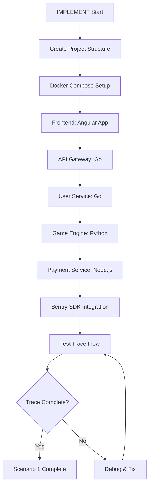

# IMPLEMENT Mode - Scenario 1: Distributed Tracing

## Current Focus
Building minimal services to demonstrate Sentry distributed tracing capabilities.

## Implementation Flow

## Service Implementation Order

1. **Project Structure & Docker**
   - Root docker-compose.yml
   - Service directories
   - Shared network for tracing

2. **Frontend (Angular)**
   - Minimal UI with Spin button
   - Sentry Angular SDK
   - Trace initiation

3. **API Gateway (Go)**
   - HTTP router (Gin/Echo)
   - Auth middleware (simple JWT)
   - Trace propagation headers

4. **User Service (Go)**
   - MongoDB connection
   - Balance check endpoint
   - Intentional slow query

5. **Game Engine (Python)**
   - Simple slot logic
   - CPU spike simulation
   - Result calculation

6. **Payment Service (Node.js)**
   - Balance update logic
   - 10% random failures
   - Transaction recording

## Sentry Integration Points

Each service must:
1. Initialize Sentry SDK
2. Set DSN from environment
3. Propagate trace headers
4. Add custom context
5. Report performance metrics

## Verification Checklist
- [ ] All services running in Docker
- [ ] Trace visible in Sentry
- [ ] All spans connected
- [ ] Performance data captured
- [ ] Errors properly tracked