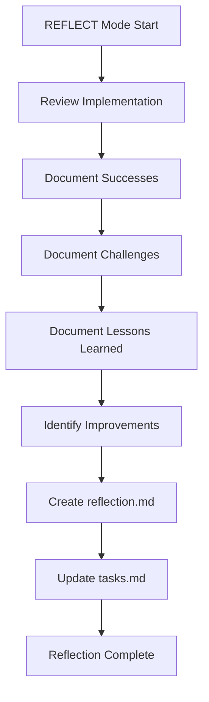

# REFLECT Mode Process Map - Scenario 1

## Purpose
Analyze and document the implementation of Scenario 1: Distributed Tracing

## Reflection Process

## Review Areas

### 1. Implementation Quality
- Code structure and organization
- Sentry SDK integration
- Intentional issues for demo
- Documentation quality

### 2. Demo Effectiveness
- Distributed tracing visibility
- Performance bottlenecks clarity
- Error tracking demonstration
- Business metrics integration

### 3. Process Efficiency
- Time taken for implementation
- Challenges encountered
- Tools and approaches used

## Verification Checklist
- [ ] All services implemented
- [ ] Sentry integration working
- [ ] Demo scenarios testable
- [ ] Documentation complete
- [ ] Memory Bank updated