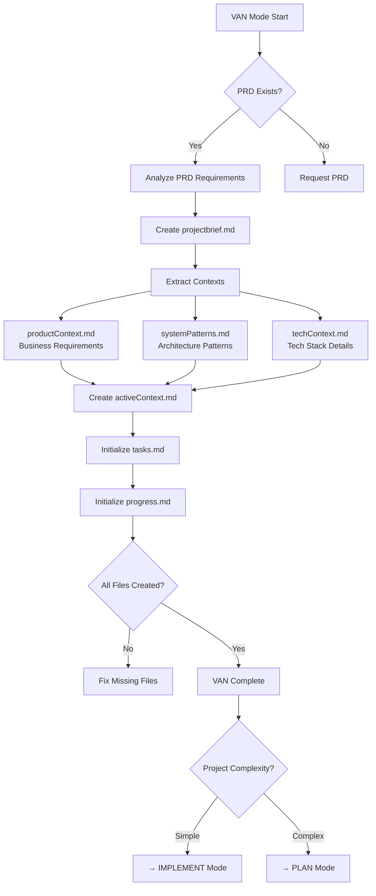

# VAN Mode Process Map

## Purpose
Initial exploration and requirements understanding phase for Sentry POC iGaming platform.

## Entry Conditions
- User activates VAN mode
- System responds "OK VAN"
- Memory Bank checked

## Process Flow

## Key Activities

### 1. Requirements Analysis
- Read and analyze prd.md
- Extract key business metrics and goals
- Identify technical requirements
- Document architecture components

### 2. Memory Bank Initialization
- Create projectbrief.md from PRD
- Extract and create context files:
  - productContext.md: Business logic, KPIs, user flows
  - systemPatterns.md: Architecture patterns, integration points
  - techContext.md: Technology choices, versions, frameworks
- Initialize activeContext.md with current focus
- Create tasks.md with initial task list
- Setup progress.md for tracking

### 3. Verification Checkpoints
- [ ] PRD fully analyzed
- [ ] All Memory Bank files created
- [ ] Context properly extracted and categorized
- [ ] Initial task list populated
- [ ] Ready for next phase

## Exit Criteria
- All Memory Bank files initialized
- Requirements documented and understood
- Clear path forward identified (PLAN or IMPLEMENT)

## Rules
1. Must read PRD before any other action
2. Must create all Memory Bank files
3. Must maintain tasks.md as single source of truth
4. Must verify all files before completion
5. Must determine next appropriate mode