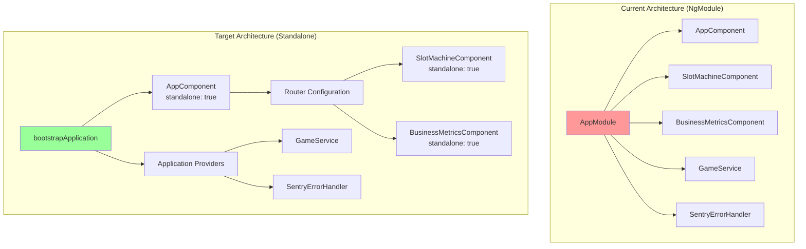

# 🎨 CREATIVE PHASE: Component Architecture Design

## PROBLEM STATEMENT
Migrate the existing NgModule-based Angular 13 application to Angular 20's standalone components architecture. The application currently has:
- AppModule as the root module
- 3 components (AppComponent, SlotMachineComponent, BusinessMetricsComponent)
- 2 services (GameService, SentryErrorHandler)
- Router configuration
- Sentry integration in main.ts

## OPTIONS ANALYSIS

### Option 1: Gradual Migration with Hybrid Approach
**Description**: Keep AppModule initially, convert components to standalone one by one
**Pros**:
- Lower risk of breaking changes
- Can test each component independently
- Easier rollback if issues arise
- Maintains compatibility during transition
**Cons**:
- Longer migration timeline
- Temporary complexity with mixed approaches
- Need to maintain both patterns
**Complexity**: Medium
**Implementation Time**: 3-4 hours

### Option 2: Full Standalone Migration
**Description**: Convert all components to standalone and use bootstrapApplication
**Pros**:
- Clean, modern architecture
- Better tree-shaking and performance
- Simpler dependency management
- Future-proof approach
**Cons**:
- Higher risk during migration
- All-or-nothing approach
- Requires updating all imports simultaneously
**Complexity**: High
**Implementation Time**: 2-3 hours

### Option 3: Module-per-Feature then Standalone
**Description**: First split into feature modules, then convert to standalone
**Pros**:
- Better organization
- Clearer separation of concerns
- Easier to identify dependencies
**Cons**:
- Extra intermediate step
- More complex migration path
- Temporary over-engineering
**Complexity**: High
**Implementation Time**: 4-5 hours

## DECISION
**Selected Approach**: Option 2 - Full Standalone Migration

**Rationale**:
1. The application is small (3 components) making full migration manageable
2. Aligns with Angular 20 best practices
3. Avoids maintaining hybrid state
4. Sentry POC benefits from modern architecture demonstration
5. Clean migration path for future developers

## IMPLEMENTATION PLAN

### 1. Bootstrap Migration
```typescript
// main.ts transformation
import { bootstrapApplication } from '@angular/platform-browser';
import { AppComponent } from './app/app.component';
import { appConfig } from './app/app.config';

// Sentry initialization remains the same
Sentry.init({...});

bootstrapApplication(AppComponent, appConfig)
  .catch(err => console.error(err));
```

### 2. App Configuration
```typescript
// app.config.ts (new file)
import { ApplicationConfig } from '@angular/core';
import { provideRouter } from '@angular/router';
import { provideHttpClient } from '@angular/common/http';
import { routes } from './app.routes';
import { providers } from './app.providers';

export const appConfig: ApplicationConfig = {
  providers: [
    provideRouter(routes),
    provideHttpClient(),
    ...providers
  ]
};
```

### 3. Component Structure
```typescript
// app.component.ts
import { Component } from '@angular/core';
import { RouterOutlet, RouterLink, RouterLinkActive } from '@angular/router';

@Component({
  selector: 'app-root',
  standalone: true,
  imports: [RouterOutlet, RouterLink, RouterLinkActive],
  template: `...existing template...`
})
export class AppComponent {}
```

### 4. Feature Components
```typescript
// slot-machine.component.ts
import { Component } from '@angular/core';
import { CommonModule } from '@angular/common';
import { GameService } from '../services/game.service';

@Component({
  selector: 'app-slot-machine',
  standalone: true,
  imports: [CommonModule],
  template: `...existing template...`
})
export class SlotMachineComponent {
  constructor(private gameService: GameService) {}
}
```

### 5. Service Provider Configuration
```typescript
// app.providers.ts
import { ErrorHandler } from '@angular/core';
import { SentryErrorHandler } from './services/sentry-error.handler';
import { GameService } from './services/game.service';

export const providers = [
  GameService,
  { provide: ErrorHandler, useClass: SentryErrorHandler }
];
```

## VISUALIZATION



## MIGRATION BENEFITS
1. **Performance**: Better tree-shaking, smaller bundles
2. **Developer Experience**: Simpler mental model, explicit dependencies
3. **Testing**: Easier component isolation
4. **Future Compatibility**: Aligned with Angular's direction

🎨 CREATIVE CHECKPOINT: Architecture design complete

🎨🎨🎨 EXITING CREATIVE PHASE - DECISION MADE 🎨🎨🎨