# 🎨 CREATIVE PHASE: Build Optimization Design with esbuild

## PROBLEM STATEMENT
Migrate the Angular build system from webpack-based `@angular-devkit/build-angular:browser` to the modern esbuild-powered `@angular-devkit/build-angular:application` builder. Current setup uses:
- Webpack-based browser builder
- Traditional optimization settings
- Separate polyfills file
- Source map configuration for Sentry

## OPTIONS ANALYSIS

### Option 1: Direct Builder Replacement
**Description**: Change builder to 'application' with minimal configuration changes
**Pros**:
- Fastest migration path
- Immediate performance benefits
- Minimal configuration changes
- Lower risk of breaking changes
**Cons**:
- May not leverage all esbuild features
- Could miss optimization opportunities
- Default settings might not be optimal
**Complexity**: Low
**Implementation Time**: 30 minutes

### Option 2: Optimized esbuild Configuration
**Description**: Full migration with custom esbuild optimizations
**Pros**:
- Maximum performance gains
- Custom optimization strategies
- Better tree-shaking
- Smaller bundle sizes
**Cons**:
- More complex configuration
- Requires testing various options
- Higher chance of issues
**Complexity**: High
**Implementation Time**: 2 hours

### Option 3: Progressive Enhancement
**Description**: Start with browser-esbuild, then migrate to application builder
**Pros**:
- Gradual migration path
- Can test at each stage
- Easier rollback
- Learn esbuild incrementally
**Cons**:
- Two-step process
- Temporary configuration
- Delayed full benefits
**Complexity**: Medium
**Implementation Time**: 1.5 hours

## DECISION
**Selected Approach**: Option 2 - Optimized esbuild Configuration

**Rationale**:
1. Sentry POC benefits from demonstrating modern build performance
2. Smaller bundles improve Sentry replay performance
3. Faster builds improve developer experience
4. Source maps critical for Sentry error tracking
5. One-time migration effort with long-term benefits

## IMPLEMENTATION PLAN

### 1. Angular.json Migration
```json
{
  "projects": {
    "frontend": {
      "architect": {
        "build": {
          "builder": "@angular-devkit/build-angular:application",
          "options": {
            "outputPath": "dist/frontend",
            "index": "src/index.html",
            "browser": "src/main.ts",
            "polyfills": ["zone.js"],
            "tsConfig": "tsconfig.app.json",
            "assets": [
              "src/favicon.ico",
              "src/assets"
            ],
            "styles": ["src/styles.css"],
            "server": false,
            "prerender": false,
            "ssr": false
          },
          "configurations": {
            "production": {
              "optimization": {
                "scripts": true,
                "styles": {
                  "minify": true,
                  "inlineCritical": true
                },
                "fonts": true
              },
              "outputHashing": "all",
              "sourceMap": {
                "scripts": true,
                "styles": true,
                "vendor": true,
                "hidden": false
              },
              "budgets": [
                {
                  "type": "initial",
                  "maximumWarning": "500kb",
                  "maximumError": "1mb"
                },
                {
                  "type": "anyComponentStyle",
                  "maximumWarning": "2kb",
                  "maximumError": "4kb"
                }
              ],
              "fileReplacements": [
                {
                  "replace": "src/environments/environment.ts",
                  "with": "src/environments/environment.prod.ts"
                }
              ]
            },
            "development": {
              "optimization": false,
              "extractLicenses": false,
              "sourceMap": true,
              "outputHashing": "none"
            }
          }
        }
      }
    }
  }
}
```

### 2. Build Performance Optimizations

#### esbuild-specific settings
```json
{
  "build": {
    "options": {
      "allowedCommonJsDependencies": [
        "@sentry/angular",
        "@sentry/tracing"
      ],
      "buildOptimizer": true,
      "aot": true,
      "optimization": {
        "scripts": true,
        "styles": {
          "minify": true,
          "inlineCritical": true,
          "removeSpecialComments": true
        }
      }
    }
  }
}
```

#### Tree-shaking Configuration
```typescript
// tsconfig.app.json updates
{
  "compilerOptions": {
    "target": "ES2022",
    "module": "ES2022",
    "moduleResolution": "bundler",
    "useDefineForClassFields": true,
    "noPropertyAccessFromIndexSignature": true,
    "noImplicitOverride": true,
    "strict": true
  }
}
```

### 3. Source Map Strategy for Sentry

#### Development Configuration
```json
{
  "development": {
    "sourceMap": {
      "scripts": true,
      "styles": true,
      "vendor": true,
      "hidden": false
    }
  }
}
```

#### Production Configuration
```json
{
  "production": {
    "sourceMap": {
      "scripts": true,
      "styles": false,
      "vendor": true,
      "hidden": true
    }
  }
}
```

#### Sentry CLI Integration Update
```bash
#!/bin/bash
# upload-sourcemaps.sh updates
SENTRY_ORG="your-org"
SENTRY_PROJECT="frontend"
VERSION=$(git rev-parse HEAD)

# Upload source maps with new dist structure
npx @sentry/cli sourcemaps upload \
  --org $SENTRY_ORG \
  --project $SENTRY_PROJECT \
  --release $VERSION \
  dist/frontend/browser
```

### 4. Bundle Analysis Tools

```json
{
  "scripts": {
    "build:analyze": "ng build --stats-json && webpack-bundle-analyzer dist/frontend/browser/stats.json",
    "build:prod": "ng build --configuration production",
    "build:dev": "ng build --configuration development"
  }
}
```

## VISUALIZATION

```mermaid
graph TD
    subgraph "Current Webpack Build"
        TS[TypeScript] --> Webpack[Webpack]
        SCSS[Styles] --> Webpack
        Assets[Assets] --> Webpack
        Webpack --> Babel[Babel Transform]
        Babel --> Terser[Terser Minify]
        Terser --> Bundles[Output Bundles]
    end
    
    subgraph "esbuild Build Pipeline"
        TSNew[TypeScript] --> esbuild[esbuild]
        SCSSNew[Styles] --> Lightning[Lightning CSS]
        AssetsNew[Assets] --> Copy[Direct Copy]
        esbuild --> Optimized[Optimized Output]
        Lightning --> Optimized
        Copy --> Optimized
    end
    
    subgraph "Performance Gains"
        BuildTime[Build Time: 60s → 10s]
        BundleSize[Bundle Size: -30%]
        TreeShaking[Better Tree Shaking]
        SourceMaps[Faster Source Maps]
    end
    
    style Webpack fill:#ff9999
    style esbuild fill:#99ff99
    style Optimized fill:#99ff99
```



## PERFORMANCE TARGETS

### Build Time Improvements
- **Development Build**: 60s → 10s (85% faster)
- **Production Build**: 120s → 20s (85% faster)
- **Incremental Rebuild**: 5s → 0.5s (90% faster)

### Bundle Size Targets
- **Main Bundle**: < 200KB (gzipped)
- **Vendor Bundle**: < 300KB (gzipped)
- **Total Initial**: < 500KB (gzipped)

### Sentry Integration
- **Source Maps**: Generated for all builds
- **Hidden in Production**: Uploaded to Sentry, not served
- **Release Tracking**: Automated with build

## MIGRATION BENEFITS
1. **Developer Experience**: 85% faster builds
2. **Performance**: Smaller bundles, faster loads
3. **Modern Stack**: Latest Angular build technology
4. **Sentry Integration**: Maintained source map support
5. **Future Ready**: Prepared for Angular ecosystem evolution

🎨 CREATIVE CHECKPOINT: Build optimization design complete

🎨🎨🎨 EXITING CREATIVE PHASE - DECISION MADE 🎨🎨🎨