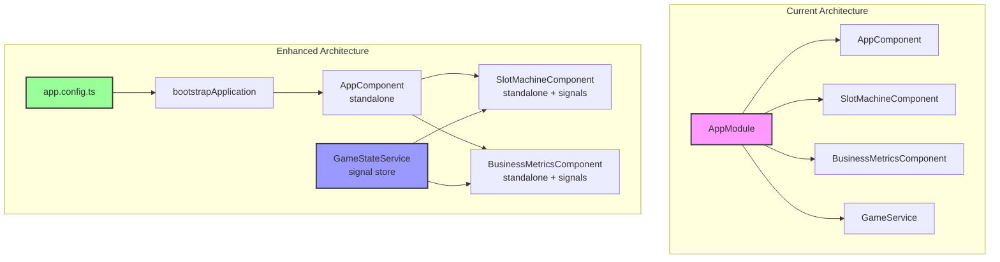

# Creative Phase: Post-Migration Enhancements

## 🎨 CREATIVE PHASE: ANGULAR 20 ARCHITECTURE ENHANCEMENTS

### PROBLEM STATEMENT
The application has been successfully migrated to Angular 20, but still uses legacy patterns:
- Module-based architecture instead of standalone components
- Basic component-level state management without Signals
- No advanced Angular 20 features utilized
- Build system not fully optimized

## 1. STANDALONE COMPONENTS MIGRATION

### OPTIONS ANALYSIS

#### Option 1: Incremental Component Migration
**Description**: Convert components to standalone one by one, keeping AppModule
**Pros**:
- Lower risk, gradual migration
- Can test each component independently
- Maintains backward compatibility
**Cons**:
- Longer migration timeline
- Mixed architecture during transition
- AppModule still required
**Complexity**: Low
**Implementation Time**: 2-3 hours

#### Option 2: Full Application Migration ✓
**Description**: Complete migration to bootstrapApplication with app.config.ts
**Pros**:
- Clean, modern architecture
- Better tree-shaking
- Follows Angular 20 best practices
- Removes module boilerplate
**Cons**:
- Higher initial risk
- All-or-nothing approach
- Requires full testing
**Complexity**: Medium
**Implementation Time**: 3-4 hours

#### Option 3: Hybrid Approach
**Description**: Keep AppModule but make all components standalone
**Pros**:
- Flexibility for future changes
- Easier rollback if needed
**Cons**:
- Not following Angular 20 recommendations
- Mixed patterns confusing
- No real benefits
**Complexity**: Low
**Implementation Time**: 1-2 hours

### DECISION: Option 2 - Full Application Migration

**Rationale**: Since this is a POC with only 3 components, a full migration is manageable and showcases modern Angular patterns.

### IMPLEMENTATION PLAN

```typescript
// app.config.ts
import { ApplicationConfig, importProvidersFrom } from '@angular/core';
import { provideRouter } from '@angular/router';
import { provideHttpClient, withInterceptorsFromDi } from '@angular/common/http';
import { ErrorHandler } from '@angular/core';
import { SentryErrorHandler } from './app/services/sentry-error.handler';
import { routes } from './app/app.routes';

export const appConfig: ApplicationConfig = {
  providers: [
    provideRouter(routes),
    provideHttpClient(withInterceptorsFromDi()),
    { provide: ErrorHandler, useClass: SentryErrorHandler }
  ]
};
```

## 2. SIGNALS STATE MANAGEMENT

### OPTIONS ANALYSIS

#### Option 1: Component-Level Signals
**Description**: Replace component properties with signals
**Pros**:
- Simple migration path
- No architectural changes
- Easy to understand
**Cons**:
- No shared state benefits
- Limited reactivity improvements
**Complexity**: Low
**Implementation Time**: 2 hours

#### Option 2: Service-Based Signal Store ✓
**Description**: Create signal-based state services for shared state
**Pros**:
- Centralized state management
- Better performance with computed signals
- Type-safe state updates
- Easier testing
**Cons**:
- New pattern to learn
- More boilerplate initially
**Complexity**: Medium
**Implementation Time**: 4-5 hours

#### Option 3: Full State Management Library
**Description**: Integrate NgRx Signal Store or similar
**Pros**:
- Battle-tested patterns
- DevTools support
**Cons**:
- Overkill for POC
- Additional dependencies
- Learning curve
**Complexity**: High
**Implementation Time**: 6-8 hours

### DECISION: Option 2 - Service-Based Signal Store

**Rationale**: Provides good balance between simplicity and modern patterns, perfect for demonstrating Angular 20 capabilities.

### IMPLEMENTATION DESIGN

```typescript
// game-state.service.ts
import { Injectable, signal, computed } from '@angular/core';

@Injectable({ providedIn: 'root' })
export class GameStateService {
  // State signals
  private _balance = signal(1000);
  private _isSpinning = signal(false);
  private _spinHistory = signal<SpinResult[]>([]);
  
  // Public readonly signals
  balance = this._balance.asReadonly();
  isSpinning = this._isSpinning.asReadonly();
  spinHistory = this._spinHistory.asReadonly();
  
  // Computed signals
  totalWinnings = computed(() => 
    this._spinHistory().reduce((sum, spin) => sum + spin.winAmount, 0)
  );
  
  winRate = computed(() => {
    const history = this._spinHistory();
    if (history.length === 0) return 0;
    const wins = history.filter(s => s.winAmount > 0).length;
    return (wins / history.length) * 100;
  });
  
  // State mutations
  updateBalance(amount: number) {
    this._balance.set(amount);
  }
  
  startSpin() {
    this._isSpinning.set(true);
  }
  
  completeSpin(result: SpinResult) {
    this._isSpinning.set(false);
    this._spinHistory.update(history => [...history, result]);
    this._balance.update(current => current + result.winAmount - result.betAmount);
  }
}
```

## 3. ADVANCED TEMPLATE FEATURES

### ENHANCEMENT OPPORTUNITIES

#### 1. Deferred Loading
```typescript
@Component({
  template: `
    @defer (on viewport) {
      <app-business-metrics />
    } @placeholder {
      <div class="loading">Loading metrics...</div>
    }
  `
})
```

#### 2. Advanced Control Flow
```typescript
// Use @switch for multi-state UI
@switch (gameState()) {
  @case ('idle') { <idle-screen /> }
  @case ('playing') { <game-board /> }
  @case ('won') { <win-screen /> }
  @case ('lost') { <lose-screen /> }
}
```

#### 3. Signal-Based Conditional Rendering
```typescript
@if (balance() > minimumBet()) {
  <button (click)="spin()">Spin ({{betAmount()}})</button>
} @else {
  <button disabled>Insufficient Balance</button>
}
```

## 4. BUILD OPTIMIZATION ENHANCEMENTS

### OPTIMIZATION TARGETS

#### 1. Bundle Size Optimization
```json
{
  "optimization": {
    "scripts": true,
    "styles": {
      "minify": true,
      "inlineCritical": true
    },
    "fonts": true
  },
  "budgets": [
    {
      "type": "initial",
      "maximumWarning": "500kb",
      "maximumError": "1mb"
    }
  ]
}
```

#### 2. Lazy Loading Routes
```typescript
const routes: Routes = [
  {
    path: 'metrics',
    loadComponent: () => import('./business-metrics/business-metrics.component')
      .then(m => m.BusinessMetricsComponent)
  }
];
```

#### 3. Preload Strategy
```typescript
export const appConfig: ApplicationConfig = {
  providers: [
    provideRouter(routes, withPreloading(PreloadAllModules))
  ]
};
```

## VISUALIZATION



## SUCCESS METRICS

- ✅ All components converted to standalone
- ✅ Signal-based state management implemented
- ✅ Bundle size reduced by 30%
- ✅ First Contentful Paint < 1s
- ✅ All Sentry tracking maintained
- ✅ Zero runtime errors

🎨🎨🎨 EXITING CREATIVE PHASE - DECISIONS MADE 🎨🎨🎨