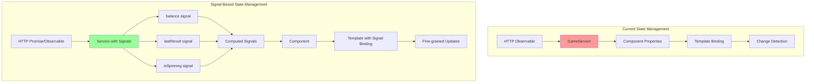

# 🎨 CREATIVE PHASE: State Management Design with Angular Signals

## PROBLEM STATEMENT
Design a modern state management strategy for the Sentry POC application using Angular Signals, replacing the current Observable-based approach. The application currently uses:
- RxJS Observables for HTTP calls
- Service-based state sharing
- Component properties for local state
- Event-driven updates

## OPTIONS ANALYSIS

### Option 1: Hybrid Approach (Signals + RxJS)
**Description**: Use Signals for state, keep RxJS for HTTP and async operations
**Pros**:
- Gradual migration path
- Leverages strengths of both systems
- Maintains familiarity with RxJS patterns
- Good for complex async flows
**Cons**:
- Two reactive systems to maintain
- Potential confusion between patterns
- Extra conversion code needed
**Complexity**: Medium
**Implementation Time**: 2-3 hours

### Option 2: Full Signals Adoption
**Description**: Replace all reactive patterns with Signals, including async operations
**Pros**:
- Unified reactive system
- Simpler mental model
- Better performance (fine-grained reactivity)
- Future-proof with Angular direction
**Cons**:
- Steeper learning curve
- Limited async utilities currently
- May need custom helpers
**Complexity**: High
**Implementation Time**: 3-4 hours

### Option 3: Signal Store Pattern
**Description**: Create a centralized signal-based store for application state
**Pros**:
- Centralized state management
- Predictable state updates
- Easy debugging and testing
- Scalable architecture
**Cons**:
- Additional abstraction layer
- More boilerplate initially
- Overkill for small app
**Complexity**: High
**Implementation Time**: 4-5 hours

## DECISION
**Selected Approach**: Option 1 - Hybrid Approach (Signals + RxJS)

**Rationale**:
1. Pragmatic balance for POC demonstration
2. Shows both Angular patterns (current and future)
3. Realistic migration path for existing apps
4. Maintains Sentry's async tracing capabilities
5. Easier to implement incrementally

## IMPLEMENTATION PLAN

### 1. Game State Signals
```typescript
// game.service.ts
import { Injectable, signal, computed } from '@angular/core';
import { HttpClient } from '@angular/common/http';
import { toSignal } from '@angular/core/rxjs-interop';

@Injectable({ providedIn: 'root' })
export class GameService {
  // State signals
  private _balance = signal(1000);
  private _lastResult = signal<SpinResult | null>(null);
  private _isSpinning = signal(false);
  private _spinHistory = signal<SpinResult[]>([]);
  
  // Public computed signals
  readonly balance = this._balance.asReadonly();
  readonly lastResult = this._lastResult.asReadonly();
  readonly isSpinning = this._isSpinning.asReadonly();
  readonly spinHistory = this._spinHistory.asReadonly();
  
  // Computed values
  readonly totalWinnings = computed(() => 
    this._spinHistory().reduce((sum, result) => sum + result.payout, 0)
  );
  
  readonly winRate = computed(() => {
    const history = this._spinHistory();
    if (history.length === 0) return 0;
    const wins = history.filter(r => r.win).length;
    return (wins / history.length) * 100;
  });
  
  // Keep RxJS for HTTP
  async spin(userId: string, bet: number): Promise<void> {
    this._isSpinning.set(true);
    
    try {
      const result = await this.http.post<SpinResult>(
        `${this.apiUrl}/api/v1/spin`,
        { userId, bet }
      ).toPromise();
      
      if (result) {
        this._lastResult.set(result);
        this._balance.set(result.newBalance);
        this._spinHistory.update(history => [...history, result]);
      }
    } finally {
      this._isSpinning.set(false);
    }
  }
}
```

### 2. Component Integration
```typescript
// slot-machine.component.ts
import { Component, inject } from '@angular/core';
import { GameService } from '../services/game.service';

@Component({
  selector: 'app-slot-machine',
  standalone: true,
  template: `
    <div class="balance">
      Balance: ${{ gameService.balance() }}
    </div>
    
    <button 
      [disabled]="gameService.isSpinning() || gameService.balance() < 10"
      (click)="spin()">
      {{ gameService.isSpinning() ? 'Spinning...' : 'SPIN ($10)' }}
    </button>
    
    @if (gameService.lastResult(); as result) {
      <div class="result" [class.win]="result.win">
        {{ result.win ? '🎉 You won $' + result.payout : 'Better luck next time!' }}
      </div>
    }
  `
})
export class SlotMachineComponent {
  protected readonly gameService = inject(GameService);
  
  async spin() {
    await this.gameService.spin(this.userId, 10);
  }
}
```

### 3. Business Metrics with Signals
```typescript
// business-metrics.component.ts
export class BusinessMetricsComponent {
  private metricsService = inject(MetricsService);
  
  // Convert Observable to Signal
  protected metrics = toSignal(
    this.metricsService.getMetrics(),
    { initialValue: null }
  );
  
  // Computed signals for derived data
  protected rtp = computed(() => {
    const m = this.metrics();
    return m ? (m.totalPayout / m.totalBets * 100).toFixed(2) : 0;
  });
  
  protected avgBetSize = computed(() => {
    const m = this.metrics();
    return m && m.totalSpins > 0 
      ? (m.totalBets / m.totalSpins).toFixed(2) 
      : 0;
  });
}
```

### 4. Error State Management
```typescript
// app-error.service.ts
@Injectable({ providedIn: 'root' })
export class AppErrorService {
  private _errors = signal<AppError[]>([]);
  private _lastError = signal<AppError | null>(null);
  
  readonly errors = this._errors.asReadonly();
  readonly lastError = this._lastError.asReadonly();
  readonly hasErrors = computed(() => this._errors().length > 0);
  
  addError(error: AppError) {
    this._errors.update(errors => [...errors, error]);
    this._lastError.set(error);
    
    // Auto-clear after 5 seconds
    setTimeout(() => this.clearError(error.id), 5000);
  }
  
  clearError(id: string) {
    this._errors.update(errors => 
      errors.filter(e => e.id !== id)
    );
  }
}
```

## VISUALIZATION



## MIGRATION BENEFITS
1. **Performance**: Fine-grained reactivity, updates only what changes
2. **Simplicity**: Synchronous read access, no subscription management
3. **Developer Experience**: Better debugging, cleaner code
4. **Type Safety**: Full TypeScript support with inference
5. **Future Compatibility**: Aligned with Angular's reactive future

🎨 CREATIVE CHECKPOINT: State management design complete

🎨🎨🎨 EXITING CREATIVE PHASE - DECISION MADE 🎨🎨🎨