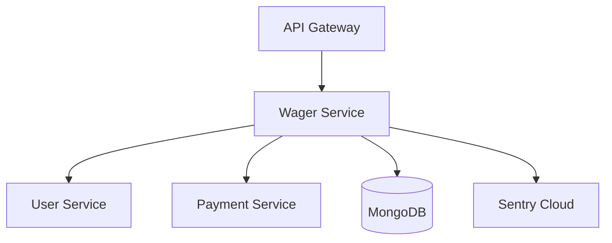

# Creative Design Document: Wager/Bonus Service Architecture

**Created**: 2025-01-07
**Task**: PHP/Symfony Wager/Bonus Service Implementation
**Phase**: CREATIVE - Architecture & Algorithm Design

## Executive Summary

This document captures the key design decisions for the PHP/Symfony Wager/Bonus Service, focusing on architecture patterns, core algorithms, and data models that balance simplicity with demonstrable Sentry monitoring capabilities.

## Architecture Design

### Selected Pattern: Simple MVC with Service Layer

**Rationale**: 
- Aligns with KISS principle for POC
- Leverages Symfony's native patterns
- Provides sufficient structure without over-engineering
- Fastest path to demonstrating Sentry capabilities

**Structure**:
```
src/
├── Controller/          # REST endpoints
│   ├── BonusController.php
│   └── WagerController.php
├── Service/            # Business logic
│   ├── BonusService.php
│   ├── WagerService.php
│   └── IntegrationService.php
├── Document/           # MongoDB ODM entities
│   ├── Bonus.php
│   └── WagerProgress.php
├── Exception/          # Custom exceptions for Sentry
│   ├── BonusException.php
│   └── WagerException.php
└── EventSubscriber/    # Sentry integration
    └── SentrySubscriber.php
```

### Integration Flow



## Algorithm Design

### Selected Approach: Simple Progress Tracking

**Core Algorithms**:

1. **Wager Validation**
   - Check for active bonus
   - Verify sufficient balance
   - Return validation result with bonus usage flag

2. **Progress Calculation**
   - Linear percentage: (wageredAmount / requiredWager) × 100
   - Capped at 100% for completion
   - Real-time updates after each wager

3. **Bonus Conversion**
   - Atomic MongoDB operation using findAndModify
   - Prevents race conditions
   - Triggers credit addition via Payment Service

### Edge Cases Handled
- Concurrent wager attempts
- Insufficient bonus balance
- Progress calculation overflow
- Conversion race conditions

## Data Model Design

### Selected Pattern: Hybrid Approach

**Collections**:

1. **Bonus Collection** (Primary State)
   - Current bonus state and balance
   - Summary statistics
   - Last wager reference
   - Optimized for reads

2. **Wager History Collection** (Audit Trail)
   - Detailed transaction log
   - Progress snapshots
   - TTL index for automatic cleanup
   - Optimized for analytics

### Key Design Decisions

1. **Atomic Operations**: All balance updates use MongoDB's atomic operators
2. **Audit Trail**: Separate collection maintains complete history
3. **Performance**: Indexes optimized for common query patterns
4. **Scalability**: TTL indexes prevent unbounded growth

## Sentry Integration Points

### Custom Monitoring
1. **Business Metrics**
   - Bonus claim rate
   - Average wager progress
   - Conversion success rate
   
2. **Performance Tracking**
   - API response times
   - Database query performance
   - Integration service latency

3. **Error Scenarios**
   - Validation failures
   - Integration timeouts
   - Concurrency conflicts

## Implementation Guidelines

### Phase 1: Foundation
- Symfony project setup with MongoDB ODM
- Basic controller/service structure
- Docker configuration

### Phase 2: Core Logic
- Implement validation algorithms
- Progress tracking service
- Atomic conversion operations

### Phase 3: Integration
- Connect to User/Payment services
- Add Sentry instrumentation
- Error handling patterns

### Phase 4: Polish
- Frontend integration
- Demo scenarios
- Performance optimization

## Risk Mitigation

1. **Data Consistency**: Atomic operations prevent partial updates
2. **Service Communication**: Circuit breakers for external calls
3. **Performance**: Caching layer for frequently accessed data
4. **Monitoring**: Comprehensive Sentry alerts for anomalies

## Success Criteria

- Clean, maintainable code following Symfony best practices
- Complete Sentry observability for all operations
- Demonstrable error scenarios for POC
- Sub-200ms response times for API calls
- 100% atomic operation success rate

## Next Steps

Proceed to IMPLEMENT phase with:
1. Environment setup (Docker, Symfony, MongoDB)
2. Core service implementation
3. Integration layer development
4. Sentry instrumentation
5. Frontend updates