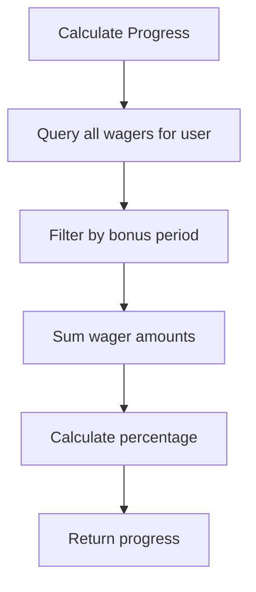
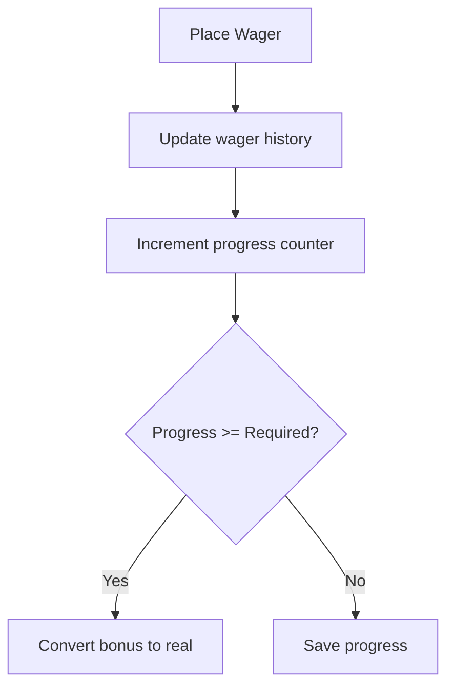
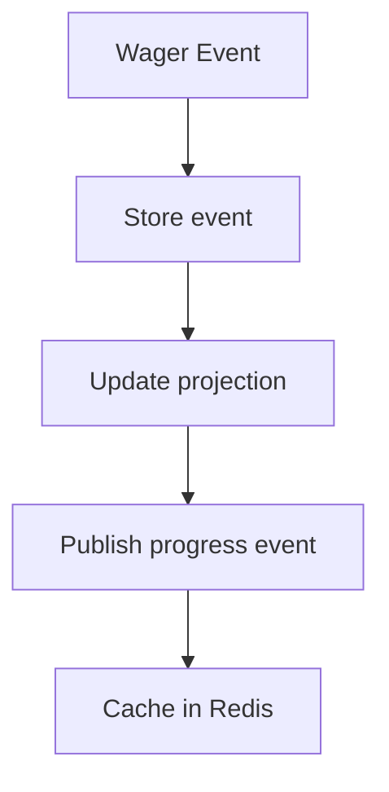
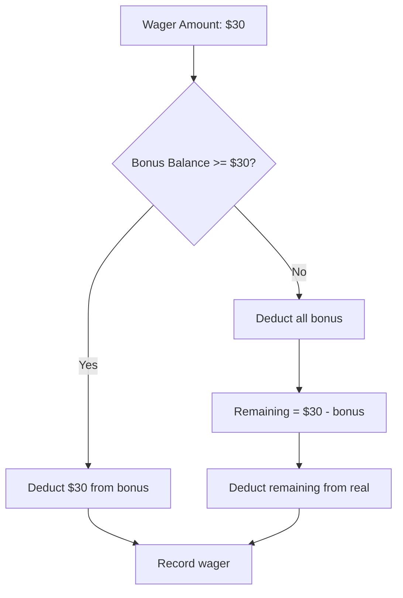

# Creative: Wager Service Algorithm Design

## Date: 2025-01-07
## Phase: CREATIVE
## Challenge: Bonus and Wagering Calculation Algorithms

## Problem Statement
Design algorithms for:
1. Wagering progress calculation
2. Bonus to real money conversion
3. Balance deduction order (bonus first, then real)
4. Concurrent wager handling

## Algorithm 1: Wagering Progress Calculation

### Option A: Real-time Aggregation


**Pros:**
- Always accurate
- No state to maintain
- Simple implementation

**Cons:**
- Slow with many wagers
- Database intensive
- Poor performance at scale

**Complexity:** Low
**Performance:** O(n) where n = number of wagers

### Option B: Incremental Updates


**Pros:**
- Fast progress checks O(1)
- Minimal database operations
- Scales well

**Cons:**
- Need to maintain state
- Risk of inconsistency
- Requires careful updates

**Complexity:** Medium
**Performance:** O(1) for checks

### Option C: Event Sourcing


**Pros:**
- Full audit trail
- Can replay events
- Natural for Sentry tracking

**Cons:**
- Over-engineered for POC
- Complex implementation
- Requires event store

**Complexity:** High
**Performance:** O(1) with caching

## Decision: Option B - Incremental Updates

### Rationale
1. **Performance**: O(1) progress checks are essential for good UX
2. **Simplicity**: Straightforward to implement with atomic operations
3. **Reliability**: MongoDB atomic updates prevent inconsistency
4. **Sentry Benefits**: Clear transaction boundaries for monitoring

### Implementation
```php
public function recordWager($userId, $amount, $gameId) {
    // Start Sentry transaction
    $transaction = \Sentry\startTransaction(['name' => 'wager.record']);
    
    // 1. Record wager history
    $wager = new WagerHistory([
        'user_id' => $userId,
        'amount' => $amount,
        'game_id' => $gameId,
        'timestamp' => new \DateTime()
    ]);
    $this->dm->persist($wager);
    
    // 2. Update progress atomically
    $this->dm->createQueryBuilder(Bonus::class)
        ->update()
        ->field('wagering_completed')->inc($amount)
        ->field('user_id')->equals($userId)
        ->field('status')->equals('active')
        ->getQuery()
        ->execute();
    
    // 3. Check if complete
    $bonus = $this->findActiveBonus($userId);
    if ($bonus && $bonus->isComplete()) {
        $this->convertBonusToReal($bonus);
    }
    
    $transaction->finish();
}
```

## Algorithm 2: Balance Deduction Order

### The Challenge
When a user wagers, deduct from bonus balance first, then real balance.

### Solution: Two-Phase Deduction


### Implementation
```php
public function deductBalance($userId, $amount) {
    $bonusBalance = $this->getBonusBalance($userId);
    $realBalance = $this->getRealBalance($userId);
    
    $bonusDeduction = min($amount, $bonusBalance);
    $realDeduction = $amount - $bonusDeduction;
    
    if ($realDeduction > $realBalance) {
        throw new InsufficientBalanceException();
    }
    
    // Atomic update both balances
    $this->dm->createQueryBuilder(UserBalance::class)
        ->update()
        ->field('bonus_balance')->dec($bonusDeduction)
        ->field('real_balance')->dec($realDeduction)
        ->field('user_id')->equals($userId)
        ->getQuery()
        ->execute();
        
    return [
        'bonus_used' => $bonusDeduction,
        'real_used' => $realDeduction
    ];
}
```

## Algorithm 3: Concurrent Wager Prevention

### Solution: Optimistic Locking with Version
```php
public function validateWager($userId, $amount) {
    // Add version check
    $balance = $this->dm->createQueryBuilder(UserBalance::class)
        ->field('user_id')->equals($userId)
        ->getQuery()
        ->getSingleResult();
    
    if ($balance->getTotalBalance() < $amount) {
        throw new InsufficientBalanceException();
    }
    
    // Use version for optimistic locking
    try {
        $this->dm->createQueryBuilder(UserBalance::class)
            ->update()
            ->field('version')->inc(1)
            ->field('last_wager_time')->set(new \DateTime())
            ->field('user_id')->equals($userId)
            ->field('version')->equals($balance->getVersion())
            ->getQuery()
            ->execute();
    } catch (ConcurrentModificationException $e) {
        throw new ConcurrentWagerException();
    }
}
```

## Algorithm 4: Bonus Conversion

### Simple Threshold Check
```php
public function checkAndConvertBonus($userId) {
    $bonus = $this->findActiveBonus($userId);
    
    if (!$bonus || !$bonus->isComplete()) {
        return false;
    }
    
    // Start transaction for consistency
    $session = $this->dm->getDocumentManager()->startSession();
    $session->startTransaction();
    
    try {
        // 1. Mark bonus as completed
        $bonus->setStatus('completed');
        $bonus->setCompletedAt(new \DateTime());
        
        // 2. Transfer bonus to real balance
        $this->dm->createQueryBuilder(UserBalance::class)
            ->update()
            ->field('real_balance')->inc($bonus->getAmount())
            ->field('bonus_balance')->set(0)
            ->field('user_id')->equals($userId)
            ->getQuery()
            ->execute();
        
        // 3. Record conversion event
        $this->eventDispatcher->dispatch(
            new BonusConvertedEvent($userId, $bonus->getAmount())
        );
        
        $session->commitTransaction();
        return true;
        
    } catch (\Exception $e) {
        $session->abortTransaction();
        throw $e;
    }
}
```

## Performance Optimizations

### 1. MongoDB Indexes
```javascript
// Optimal indexes for our algorithms
db.bonuses.createIndex({ "user_id": 1, "status": 1 })
db.wager_history.createIndex({ "user_id": 1, "timestamp": -1 })
db.user_balances.createIndex({ "user_id": 1 }, { unique: true })
```

### 2. Caching Strategy (Future)
```php
// Cache active bonus in Redis
$cacheKey = "bonus:active:{$userId}";
$bonus = $this->redis->get($cacheKey);
if (!$bonus) {
    $bonus = $this->findActiveBonus($userId);
    $this->redis->setex($cacheKey, 300, $bonus); // 5 min TTL
}
```

## Sentry Integration Benefits
1. **Transaction Tracking**: Each algorithm wrapped in Sentry transaction
2. **Performance Monitoring**: Track slow queries and calculations
3. **Error Context**: Rich context for debugging concurrent issues
4. **Business Metrics**: Track conversion rates and wagering velocity