# CLAUDE.md

This file provides guidance to Claude Code (claude.ai/code) when working with code in this repository.

## Memory Bank System Overview

Memory Bank is a token-optimized, hierarchical task management system originally designed for universal development phases. This codebase demonstrates how to translate platform-specific agent instructions into universal, platform-agnostic development workflows that can be used with any AI agent.

### Core Concept: Universal Agent Translation

The key innovation is translating universal development phases (which are limited to specific editor features) into a universal "memory bank" approach that works with any AI assistant by:

1. **Modes → Development Phases**: Each phase (VAN, PLAN, CREATIVE, etc.) represents a specific development phase with its own cognitive model
2. **Custom Instructions → Persistent Context**: Mode-specific instructions become persistent context files stored in the memory-bank/ directory
3. **Tool Selection → Phase-Appropriate Actions**: Each phase enables only relevant capabilities
4. **Visual Process Maps → Decision Trees**: Mermaid diagrams provide workflow guidance independent of the AI platform

### Memory Bank Storage

All persistent context is stored in the `memory-bank/` directory at the project root:

```
memory-bank/
├── tasks.md              # Central task tracking
├── activeContext.md      # Current development focus
├── progress.md           # Implementation status
├── creative-*.md         # Design decision documents
└── reflect-*.md          # Review and lessons learned
```

## Common Development Commands

### Working with Memory Bank Files

```bash
# View current tasks
cat memory-bank/tasks.md

# Update active context
echo "New context information" >> memory-bank/activeContext.md

# Check implementation progress
cat memory-bank/progress.md
```

### Rule System Navigation

```bash
# View main rule entry point
cat universal_rules/main-optimized.md

# List all rule files
find universal-system/universal_rules -name "*.md" -type f

# View visual process maps
ls universal_rules/visual-maps/
```

### Mode Instructions

```bash
# View all mode instructions
ls custom_modes/

# Read specific mode instructions
cat custom_modes/van_instructions.md
```

## High-Level Architecture

### 1. Development Workflow Phases

The system uses 6 specialized phases that form a complete development workflow:

```mermaid
graph LR
    VAN[🔍 VAN<br>Initialize] --> PLAN[📋 PLAN<br>Task Planning]
    PLAN --> CREATIVE[🎨 CREATIVE<br>Design]
    CREATIVE --> IMPLEMENT[⚒️ IMPLEMENT<br>Build]
    IMPLEMENT --> REFLECT[🔍 REFLECT<br>Review]
    REFLECT --> ARCHIVE[📚 ARCHIVE<br>Document]
```



### 2. Hierarchical Rule Loading

Rules are organized hierarchically to optimize token usage:

```
universal_rules/
├── main-optimized.md        # Entry point with JIT loading
├── Core/                     # Shared across all modes
│   ├── core-mode-behavior.md
│   └── platform-awareness.md
├── Level1-4/                 # Complexity-specific workflows
├── Phases/                   # Mode-specific rules
└── visual-maps/              # Process guidance diagrams
```

### 3. Complexity Levels

Tasks are categorized into 4 levels with adapted workflows:

- **Level 1**: Quick fixes (3 phases: VAN → IMPLEMENT → REFLECT)
- **Level 2**: Enhancements (4 phases: add PLAN)
- **Level 3**: Features (5 phases: add CREATIVE)
- **Level 4**: Enterprise (6 phases: add ARCHIVE)

### 4. Universal Translation Principles

When translating platform-specific instructions to universal agent instructions:

1. **Replace mode switching** with context file updates in memory-bank/
2. **Convert tool selections** to phase-appropriate action recommendations
3. **Transform custom instructions** into persistent markdown documents
4. **Maintain visual process maps** as universal workflow guides
5. **Use hierarchical loading** by referencing only needed documentation

## Key Implementation Patterns

### 1. Phase Transitions

Instead of switching phases, update the activeContext.md file:

```markdown
# activeContext.md
Current Phase: IMPLEMENT
Previous Phase: PLAN
Task Focus: User authentication feature
Complexity Level: 3
```

### 2. Task Tracking

Maintain tasks.md as the central source of truth:

```markdown
# tasks.md
## Active Tasks
- [ ] Implement user authentication (Level 3)
  - [x] Design authentication flow
  - [ ] Build login component
  - [ ] Add session management

## Completed Tasks
- [x] Setup project structure
```

### 3. Design Documentation

Create creative-*.md files for design decisions:

```markdown
# creative-auth-2024-01-15.md
## Authentication Design Options

| Option | Pros | Cons | Decision |
|--------|------|------|----------|
| JWT | Stateless, scalable | Token management | ✓ Selected |
| Sessions | Simple, secure | Server state | Not selected |
```

### 4. Progress Tracking

Update progress.md with implementation status:

```markdown
# progress.md
## Current Sprint
- Login component: 80% complete
- Session management: Not started
- Error handling: In progress
```

## Universal Agent Usage

To use this system with any AI agent:

1. **Initialize**: Create memory-bank/ directory and initial files
2. **Check Phase Status**: Read phase-context.md for current phase
3. **Use Phase Commands**: 
   - `PHASE:STATUS` - Check current phase
   - `PHASE:TRANSITION <target>` - Change phases
   - `PHASE:VALIDATE` - Verify consistency
   - `PHASE:CAPABILITIES` - List available actions
4. **Load Phase Rules**: Reference universal format rules based on phase
5. **Update Context**: Maintain all memory bank files
6. **Track Progress**: Use tasks.md and progress.md for state management
7. **Document Decisions**: Create timestamped creative-*.md and reflect-*.md files

## Universal Documentation Resources

### Phase 2 Documentation (NEW)
- **Memory Bank Guide**: `docs/memory-bank-universal-guide.md` - Comprehensive guide to using Memory Bank universally
- **Usage Examples**: `examples/phase-usage-examples.md` - Concrete examples for each phase
- **State Persistence**: `docs/state-persistence-protocols.md` - Protocols for maintaining state
- **Workflow Maps**: `docs/universal-workflow-maps.md` - Visual process maps with universal terminology

## Implementation Components

### Phase Management System
- **Location**: `memory-bank/phase-context.md`
- **Purpose**: Replaces universal development phases with universal phases
- **Features**: State tracking, capability management, transition validation

### Phase Definitions
- **Location**: `memory-bank/phase-definitions/*.yaml`
- **Purpose**: Define each phase's capabilities and rules
- **Phases**: VAN, PLAN, CREATIVE, IMPLEMENT, REFLECT, ARCHIVE

### Universal Rule Format
- **Template**: `templates/universal-rule-template.md`
- **Format**: Hybrid Markdown+Metadata with YAML frontmatter
- **Features**: Dependencies, triggers, capabilities, hierarchical loading

### Rule Loading Strategy
- **Config**: `memory-bank/rule-loading-strategy.yaml`
- **Purpose**: Optimize token usage through smart loading
- **Strategy**: Load only needed rules based on phase and complexity

## Important Notes

- **Token Optimization**: Only load rules relevant to the current phase
- **Visual Guidance**: Use Mermaid diagrams for complex decision flows
- **Persistent Context**: All state is maintained in memory-bank/ files
- **Platform Agnostic**: Commands and workflows work across all platforms
- **Adaptive Complexity**: Adjust workflow based on task complexity level

## Development Tips

1. **Start with VAN phase** to analyze and understand the project
2. **Use visual maps** in universal_rules/visual-maps/ for guidance
3. **Maintain memory-bank/** files to preserve context across sessions
4. **Reference specific rule files** instead of loading all rules
5. **Follow the complexity level** to determine appropriate workflow

This approach enables any AI agent to implement the sophisticated Memory Bank workflow system without being tied to platform-specific features.