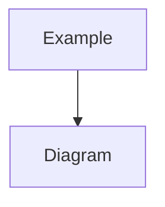

---
# Universal MDC Format v1.0
rule: rule-identifier
type: [core|phase|level|visual-map]
description: Brief description of the rule's purpose
version: 1.0
created: YYYY-MM-DD
modified: YYYY-MM-DD

dependencies:
  required:
    - core/base-rules
    - core/memory-bank
  optional:
    - visual-maps/process-flow
    - phase/specific-rules

triggers:
  phases: [van, plan, creative, implement, reflect, archive]
  complexity: [1, 2, 3, 4]
  conditions:
    - condition_1: "description"
    - condition_2: "description"
  
capabilities:
  enabled:
    - read_files
    - analyze_code
    - create_plans
  disabled:
    - execute_code
    - modify_system_files

metadata:
  token_weight: [light|medium|heavy]
  priority: [low|medium|high|critical]
  cache_strategy: [persistent|session|temporary]
  load_timing: [immediate|lazy|on_demand]
---

# Rule Title

> **TL;DR:** Brief summary of what this rule does and when it's used.

## Overview

Detailed description of the rule's purpose, context, and importance.

## When to Apply

Conditions and scenarios when this rule should be loaded and applied.

## Rule Content

[Main rule content - can include markdown, code blocks, mermaid diagrams, etc.]

## Implementation Guidelines

How to apply this rule in practice.

## Examples

Concrete examples of the rule in action.

## Validation

How to verify the rule is being followed correctly.

## Related Rules

- Link to related rule 1
- Link to related rule 2

## Notes

Additional context or special considerations.