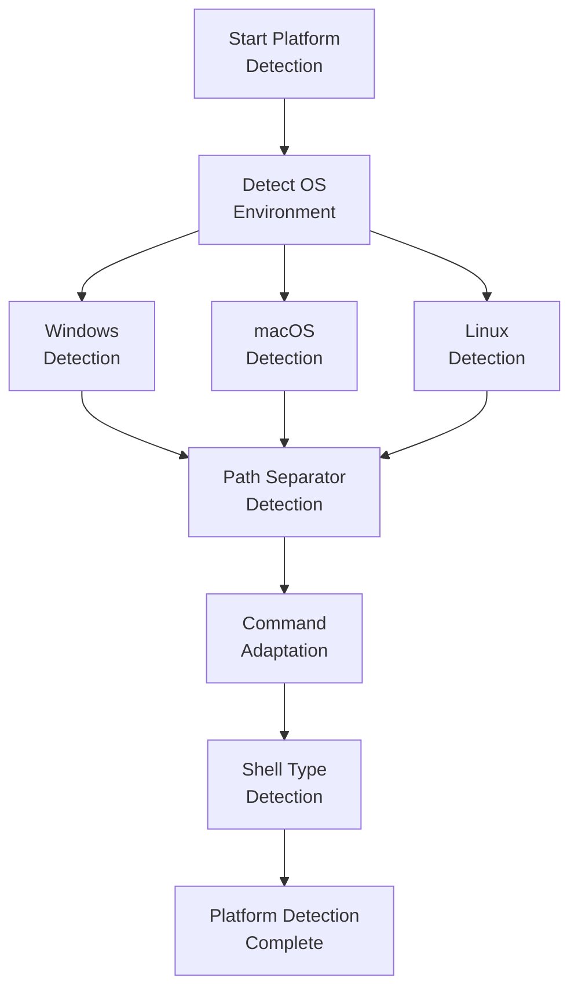
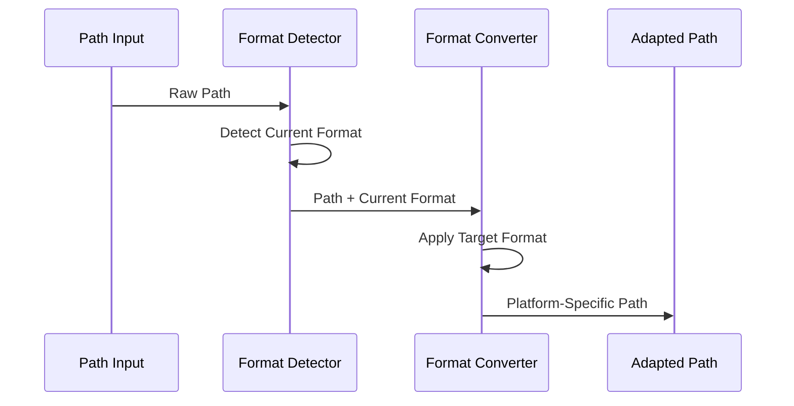

---
# Universal MDC Format v1.0
rule: platform-awareness
type: core
description: This system detects the operating system, path format, and shell environment,
  then adapts commands accordingly to ensure cross-platform compatibility.
version: '1.0'
created: '2025-06-28'
modified: '2025-06-28'
dependencies:
  required:
  - core/main
  optional: []
triggers:
  phases:
  - van
  - plan
  - creative
  - implement
  - reflect
  - archive
  complexity:
  - 1
  - 2
  - 3
  - 4
  conditions:
  - always_loaded: Core rules are always available
capabilities:
  enabled:
  - rule_loading
  - memory_bank_operations
  - execute_commands
  disabled:
  - delete_system_files
  - modify_critical_configs
metadata:
  token_weight: medium
  priority: critical
  cache_strategy: persistent
  load_timing: immediate
---

# PLATFORM AWARENESS SYSTEM

---
description: Platform detection and command adaptation for isolation-focused Memory Bank
globs: platform-awareness.md
alwaysApply: false
---


# PLATFORM AWARENESS SYSTEM

> **TL;DR:** This system detects the operating system, path format, and shell environment, then adapts commands accordingly to ensure cross-platform compatibility.

## 🔍 PLATFORM DETECTION PROCESS



## 📋 PLATFORM DETECTION IMPLEMENTATION

For reliable platform detection:

```
## Platform Detection Results
Operating System: [Windows/macOS/Linux]
Path Separator: [\ or /]
Shell Environment: [PowerShell/Bash/Zsh/Cmd]
Command Adaptation: [Required/Not Required]

Adapting commands for [detected platform]...
```

## 🔍 PATH FORMAT CONVERSION

When converting paths between formats:



## 📝 PLATFORM VERIFICATION CHECKLIST

```
✓ PLATFORM VERIFICATION
- Operating system correctly identified? [YES/NO]
- Path separator format detected? [YES/NO]
- Shell environment identified? [YES/NO]
- Command set adapted appropriately? [YES/NO]
- Path format handling configured? [YES/NO]

→ If all YES: Platform adaptation complete
→ If any NO: Run additional detection steps
``` 