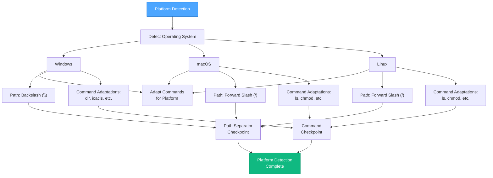

---
# Universal MDC Format v1.0
rule: van-platform-detection
type: visual-map
description: Detects the OS, determines path separators, and notes command adaptations
  required.
version: '1.0'
created: '2025-06-28'
modified: '2025-06-28'
dependencies:
  required:
  - core/main
  optional: []
triggers:
  phases:
  - van
  complexity:
  - 1
  - 2
  - 3
  - 4
  conditions: []
capabilities:
  enabled:
  - read_files
  - execute_commands
  disabled:
  - delete_system_files
  - modify_critical_configs
metadata:
  token_weight: light
  priority: medium
  cache_strategy: temporary
  load_timing: on_demand
---

# VAN MODE: PLATFORM DETECTION

---
description: Visual process map for VAN mode platform detection
globs: van-platform-detection.md
alwaysApply: false
---
# VAN MODE: PLATFORM DETECTION

> **TL;DR:** Detects the OS, determines path separators, and notes command adaptations required.

## 🌐 PLATFORM DETECTION PROCESS



## 📋 CHECKPOINT VERIFICATION TEMPLATE (Example)

```
✓ SECTION CHECKPOINT: PLATFORM DETECTION
- Operating System Detected? [YES/NO]
- Path Separator Confirmed? [YES/NO]
- Command Adaptations Noted? [YES/NO]

→ If all YES: Platform Detection Complete.
→ If any NO: Resolve before proceeding.
```

**Next Step:** Load and process `van-file-verification.md`. 